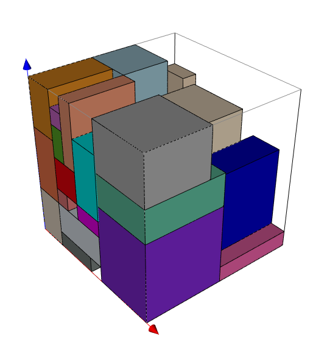
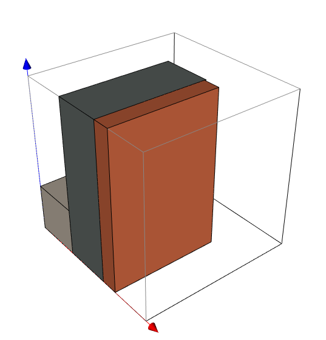

# Train
```bash
python train.py --config train.yaml --device 0
```

# Test

### Use random items to test

First, change the box_type in test.yaml into **random**, then
```bash
python test.py --config test.yaml --ckp models/10-10-10.pth --device 0 --render
```

### Use cut items to test
First, change the box_type in test.yaml into **dataset**, then
```bash
python test.py --config test.yaml --ckp models/10-10-10.pth --device 0 --render
```


## If you want test new cut example
```bash
python dataset.py
```