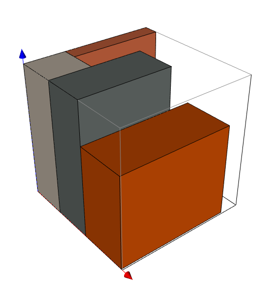
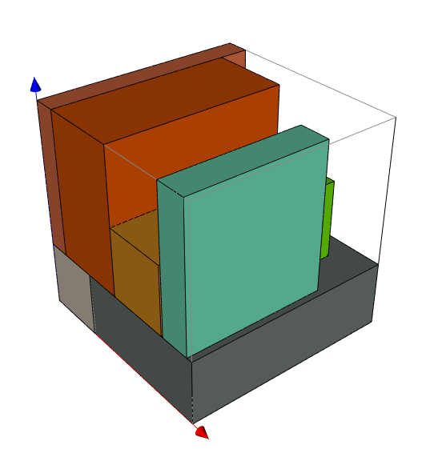

# Task1 with Greedy Algorithm
```bash
 python greedy.py --config config.yaml --ckp models/10-10-10.pth --device 0
```

# Task1 with DFS Algorithm
```bash
python dfs.py --config config.yaml --ckp models/10-10-10.pth --device 0
```
Because I wrote the pruning algorithm, the code will run faster and faster, so please don't be intimidated by the initial time estimates.


## If you want test new example
```bash
python dataset.py
```